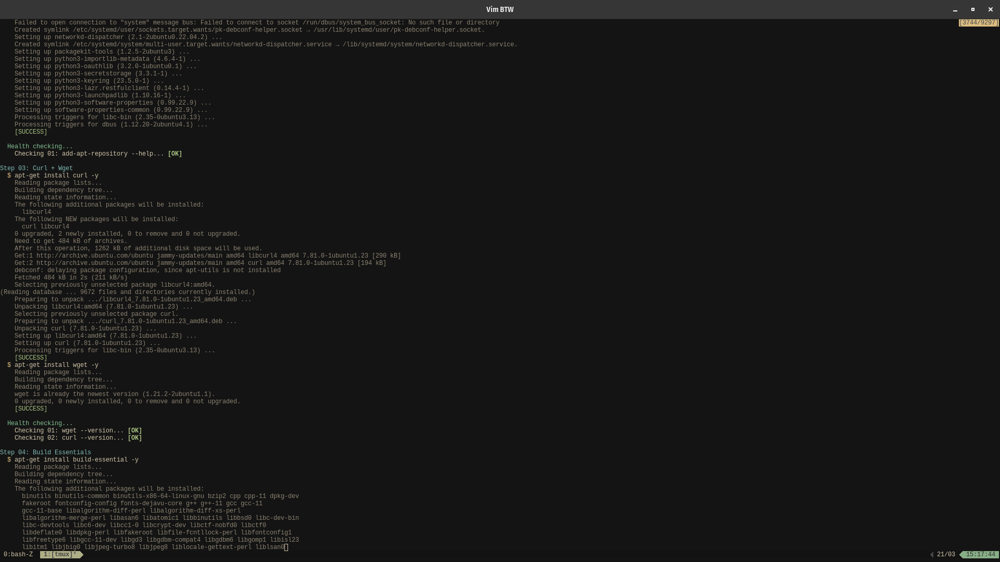

# Config manager



> [!WARNING]
> These are **my** personal configurations. Maybe it will not work on your environment.

This is my tools config manager. It provides configuration for:

- Tmux
- Alacritty
- Helix (disabled)
- Vim
- Neovim
- Git config
- Nim
- Go
- Rust
- .NET
- C and family (clang, gcc, make, etc)

If you want to see every single command that this tool will run on your machine
during the installation process, you can view [this file](./commands/install-pipeline.go).

## Installing the tool

```bash
git clone https://github.com/marcos-venicius/config-manager.git ~/.config-manager && go install github.com/marcos-venicius/config-manager
```

## Testing during development

Since I don't want you to break your system just to test this tool, you can execute this via docker.

You just need to have `docker` and `make` installed on your machine.

Then, run `make`.

This command will install and configure all the tools inside a docker container and you will seed all the logs during
the process.

Once you did that, you can clean up the room by running `make clean`.

## Tasks

- Wodo (later)
- Make it possible to the user exclude some tools of the installation. Something like: `./config-manager install -ignore helix,go`. Of course, if you ignore the `cargo` installation you won't be able to install Alacritty. So, you have the power but also the consequences. _With great power comes great responsibility_ **I'm still studying if this option makes sense**
