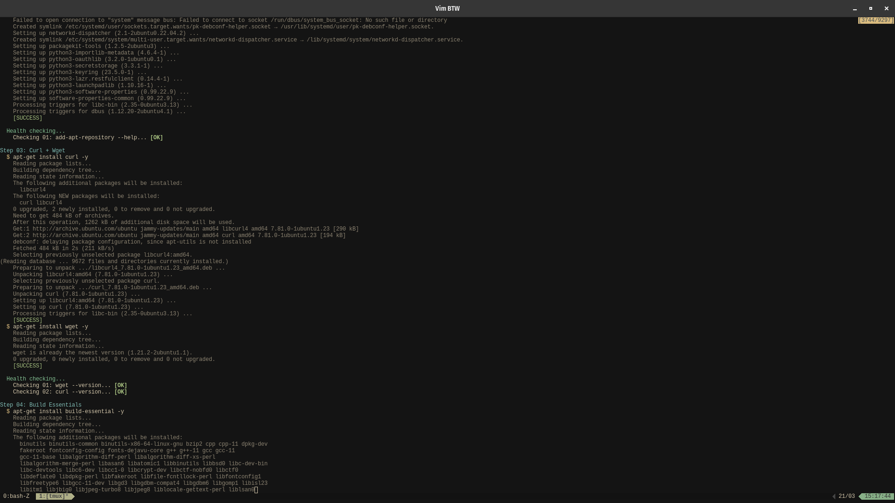

# Config manager



> [!WARNING]
> These are **my** personal configurations. Maybe it will not work on your environment.

This is my tools config manager. It provides configuration for:

- Tmux (with tpm: Catppuccin, resurrect and continuum)
- Tmuxer (my tmux session setup tool, built from source)
- Mark (my markdown viewer, registered as the default `.md` handler)
- Claude Code (native install, keeps itself updated)
- Alacritty (default terminal: GNOME, COSMIC, x-terminal-emulator and xdg default apps)
- Helix (default editor, every vim/neovim package is removed)
- Git config
- Bash
- Kubectl
- Nim
- Go
- Rust
- .NET
- C and family (clang, gcc, make, etc)

If you want to see every single command that this tool will run on your machine
during the installation process, you can view [this file](./commands/install-pipeline.go),
or run `config-manager list` to print the pipeline with its groups and dependencies.

## Commands

```bash
sudo config-manager install      # run the pipeline
sudo config-manager update       # pull and rebuild what was built from source
sudo config-manager uninstall    # remove what this tool created
config-manager list              # print the pipeline, touching nothing
```

`update` only touches the tools built from a git clone (helix, tmuxer, mark): it pulls, rebuilds and
health checks them. A step that is not installed yet is skipped — that is `install`'s job.

`uninstall` removes **only what this tool created**: the `/usr/local/bin` symlinks, the
`update-alternatives` entries, the desktop entries and icons it wrote, the dotfile symlinks, and
`cargo uninstall alacritty`. It runs the pipeline backwards and is best effort, so a command with
nothing left to remove does not stop it.

It deliberately does **not** touch apt packages, toolchains (`~/.cargo`, `~/.nimble`, `/opt/go`,
`~/.dotnet`) or the clones in `~/tools`. A dotfile is only unlinked when it still points at this
repository, so a link you repointed somewhere else survives. The `<name>.bak.<timestamp>` copies
made during install are left where they are — restoring the right one is your call.

## Ignoring steps

Every step belongs to one or more groups. Use `-ignore` to skip them:

```bash
sudo config-manager install -ignore desktop,dotnet
```

Run `config-manager help` to list the groups.

Dependencies **are** resolved: a step can declare the groups it needs, and ignoring one of those
also skips everything that depends on it, transitively. Ignoring `cargo` therefore skips `helix`,
`alacritty` and `mark` as well, and the output says why:

```
Step 14/33 (ignored: helix needs cargo): Download & Build Helix
```

## Running a single group

`-only` is the inverse: it runs the groups you name and skips everything else.

```bash
sudo config-manager install   -only claude
sudo config-manager update    -only tmuxer
sudo config-manager uninstall -only mark
```

`install` pulls in whatever the named groups are built on, transitively, so you do not have to
know the graph. `base` always comes along, since every group assumes apt, curl and build-essential.
It tells you what it added:

```
$ sudo config-manager install -only tpm
-only tpm also runs what it needs: base, git, tmux, configs
```

Anything already in place is skipped by its health checks, so the extra groups usually cost seconds.

`update` and `uninstall` do **not** expand: they run exactly the groups you name. Uninstalling
`tpm` should not drag your dotfile symlinks out with it.

`-only` cannot be combined with `-ignore`.

## Desktop (GNOME)

The `desktop` group applies my GNOME preferences:

- Alt+Tab / Super+Tab only show what is in the current workspace
- Workspaces span every monitor (not only the primary one)
- The dock only shows apps from the current workspace
- Alt+Tab switches windows, Super+Tab switches applications
- Alacritty as the default terminal

## Configs

The files inside [configs](./configs) are **symlinked** into your home (`~/.bashrc`, `~/.gitconfig`, `~/.tmux.conf`,
`~/.config/alacritty`, `~/.config/helix/*.toml`), so editing them on the system edits the repository.

If a regular file/folder already exists in the destination, it is moved to `<name>.bak.<timestamp>` first.

The repository is found in this order: `CONFIG_MANAGER_DIR` if you set it, then the directory you
are running from if it has a `configs/`, then `~/.config-manager`. So running it out of a clone
works wherever the clone lives:

```bash
cd ~/tools/config-manager && sudo ./config-manager install
```

Set `CONFIG_MANAGER_DIR` when the binary is installed elsewhere and you are not in the clone:

```bash
sudo CONFIG_MANAGER_DIR=~/tools/config-manager config-manager install
```

If none of the three resolves, it says so and exits before running a single step, rather than
failing on the link step twenty minutes in.

Machine-specific or sensitive settings (passwords, work paths, `KUBECONFIG`, ...) must go in `~/.bashrc.local`,
which is sourced by `.bashrc` and is **not** versioned.

## Installing the tool

```bash
git clone https://github.com/marcos-venicius/config-manager.git ~/.config-manager && go install github.com/marcos-venicius/config-manager
```

## Testing during development

Since I don't want you to break your system just to test this tool, you can execute this via docker.

You just need to have `docker` and `make` installed on your machine.

Then, run `make`.

This command will install and configure all the tools inside a docker container and you will seed all the logs during
the process.

Once you did that, you can clean up the room by running `make clean`.

## Tasks

- Wodo (later)
